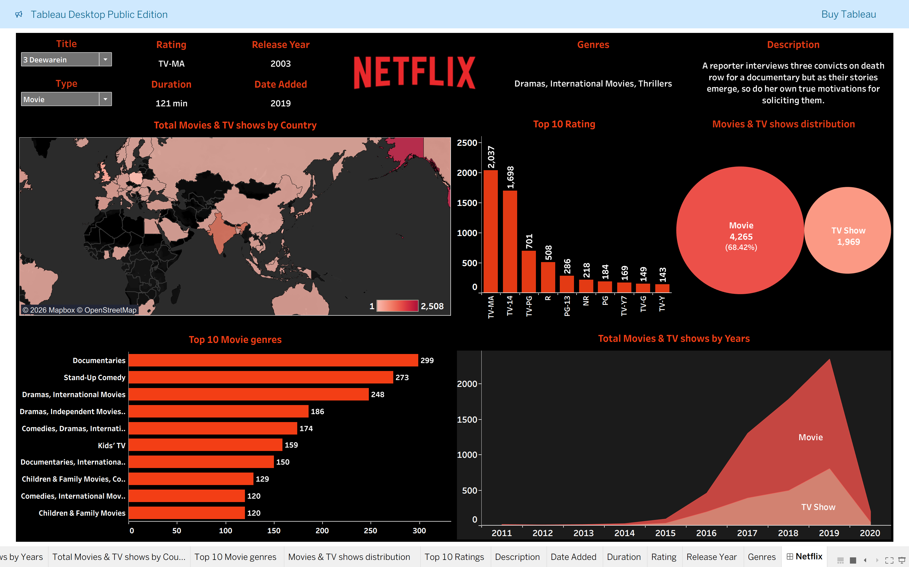

<div align="center">


<br/>


<br/><br/>


<br/>

</div>

---

## 🌟 Project Overview

> *Turning Netflix's massive content library into data-driven storytelling — one line of code at a time.*

This project covers the **complete data analytics pipeline** on Netflix's content dataset — from raw CSV to a fully interactive Tableau dashboard revealing deep patterns in global streaming content.

| Stage | Tool | What was done |
|---|---|---|
| 🧹 Data Cleaning | Python + Pandas | Null handling, type fixes, standardization, deduplication |
| 🔍 Exploratory Analysis | Python + Pandas | Aggregations, groupby, value counts, trend extraction |
| 📊 Visualization | Tableau | Multi-view interactive dashboard |

---

## 🖼️ Dashboard Preview

<div align="center">
  
  <br/><br/>
  <sub>📍 Tableau Interactive Dashboard — Netflix Content Analytics</sub>
</div>

---

## 📊 Key Numbers at a Glance

<div align="center">

| 🎬 Total Titles | 🎥 Movies | 📺 TV Shows | 🌍 Countries |
|:---:|:---:|:---:|:---:|
| **6,234** | **4,265 (68.42%)** | **1,969 (31.58%)** | **554** |

| ⭐ Top Rating | 🎭 Top Genre | 📅 Peak Year Added | ⏱️ Avg Movie Duration |
|:---:|:---:|:---:|:---:|
| **TV-MA (2,037)** | **Documentaries (299)** | **2019 (1,134 titles)** | **99.1 min** |

</div>

---

## 🔍 Top Insights (via Pandas EDA)

```
🏆  TV-MA Rating          →   Most Common Content     →   2,037 titles
📅  2019 Peak Year        →   Highest Additions       →   1,134 titles added
🎭  Documentaries         →   #1 Genre                →   299 titles
😄  Stand-Up Comedy       →   #2 Genre                →   273 titles
🌏  United States         →   Top Producer            →   2,508 titles
🇮🇳  India                →   #2 Producer             →   777 titles
📺  Movies Dominate       →   Content Split           →   68.42% of catalog
📆  Content Range         →   Oldest to Newest        →   1925 – 2020 (95 years!)
🎞️  1 Season TV Shows     →   Most Common Format      →   1,321 shows
```

---

## 📈 Dashboard Views Breakdown

### 🗺️ Geographic Distribution
- Heat map showing Netflix content volume **per country**
- **United States (2,508)** and **India (777)** are the dominant producers

### ⭐ Rating Distribution (Top 10)
| Rating | Count |
|--------|-------|
| TV-MA | 2,037 |
| TV-14 | 1,698 |
| TV-PG | 701 |
| R | 508 |
| PG-13 | 286 |

### 🎭 Top 10 Genres
| Genre | Count |
|---|---|
| Documentaries | 299 |
| Stand-Up Comedy | 273 |
| Dramas, International Movies | 248 |
| Dramas, Independent Movies, International Movies | 186 |
| Comedies, Dramas, International Movies | 174 |

### 📅 Content Added Over Time (2011–2020)
- Explosive **library growth starting 2016**
- Peak in **2019 with 1,134 new additions**
- Movies consistently outnumber TV Shows year-over-year

### 🔵 Type Distribution
- **Movies: 4,265** (68.42%) vs **TV Shows: 1,969** (31.58%)
- Most TV shows have only **1 Season** (1,321 out of 1,969)

---

## 🔄 Workflow


---

## 🧹 Data Cleaning Steps (Pandas)

- ✅ Loaded raw CSV — inspected shape (`6234 rows × 13 cols`), dtypes, null counts
- ✅ Handled missing values in `director`, `cast`, `country`, `date_added`, `rating`, `duration`
- ✅ Standardized `date_added` → proper datetime format, extracted `year_added`
- ✅ Cleaned `duration` column — separated movie minutes from TV show seasons
- ✅ Removed duplicate `show_id` entries & reset index
- ✅ Verified all 13 columns have **zero nulls** in cleaned dataset
- ✅ Exported clean data as `clean_netflix_titles_data.csv`

---

 

## 📁 Project Structure

```
📦 Netflix-Content-Analytics-Dashboard/
│
├── 📂 Code/
│   └── 📄 netflix_cleaning_eda.ipynb    ← Python cleaning + EDA notebook
│
├── 📂 Data/
│   ├── 📄 netflix_titles.csv               ← Original Kaggle dataset
│   └── 📄 clean_netflix_titles_data.csv ← Post-cleaning dataset
│
├── 📂 img/
│   └── 🖼️  NetflixDashboard.png         ← Dashboard screenshot
│
├── 📄 Netflix Dashboard.twb             ← Tableau workbook file
└── 📜 README.md
```

---

## 💡 What I Learned

- 🔧 **Real-world data** is always messy — cleaning is 70% of the actual work
- 🐼 **Pandas** is incredibly powerful for finding patterns without needing SQL
- 🎨 **Tableau** turns raw numbers into compelling visual stories
- 🔁 **End-to-end pipeline thinking** — from raw CSV to polished dashboard — is the real industry skill

---

## 🚀 Future Improvements

- [ ] 🤖 Build a content recommendation system using ML
- [ ] ⚡ Connect Tableau to a live data source for real-time updates  
- [ ] 🌐 Add language-level breakdown of international content
- [ ] 📐 Advanced Tableau LOD expressions & calculated fields
- [ ] 🎬 Director & actor co-appearance network graph analysis
- [ ] 📊 Sentiment analysis on descriptions using NLP

---

## 📦 Dataset

- **Source:** [Netflix Movies and TV Shows — Kaggle](https://www.kaggle.com/datasets/shivamb/netflix-shows)
- **Records:** 6,234 titles (after cleaning)
- **Time Range:** 1925 – 2020
- **Features:** `show_id`, `type`, `title`, `director`, `cast`, `country`, `date_added`, `release_year`, `rating`, `duration`, `listed_in`, `description`

---

## 🤝 Connect with Me

<div align="center">

[](https://instagram.com/itz_roshansingh)
&nbsp;
[](https://linkedin.com/in/itz-roshan)
&nbsp;
[](https://github.com/itz-roshan)

</div>

---

<div align="center">


*Dataset from [Kaggle](https://www.kaggle.com/) • Made with ❤️ by [@roshan](https://instagram.com/itz_roshansingh)*

</div>
